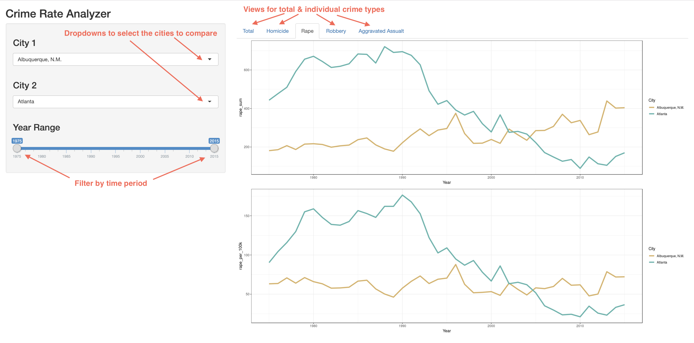
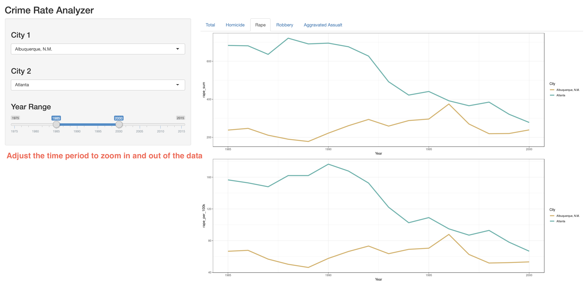

# DSCI_532_Arzan_Brenden

| File Placeholder                |                         |
| ------------------------------- | ----------------------- |
| [Deployed Shiny App](#)         | [Click here](https://arzan-irani.shinyapps.io/city-crime-comparison/) |
| [Rendered Milestone Writeup](#) | [Click here](https://github.com/UBC-MDS/DSCI_532_Arzan_Brenden/blob/master/Milestone2_Writeup.md) |
| [Shiny App Source Code](#)      |  [Click here](https://github.com/UBC-MDS/DSCI_532_Arzan_Brenden/blob/master/City-Crime-Comparison/app.R) |

In the event that you are unable to open the app, below are the screenshots demonstrating all of our intended functionality for this milestone.  

The image are annotated and self-explanatory.

### Features
</img>  
***
</img>
***
</img>
***
</img>
***
</img>
